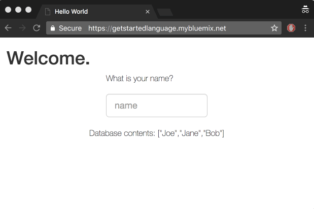

# Liberty getting started application
This app expands on The Getting Started tutorial for Liberty which uses a sample application to provide you with a sample workflow for working with any Liberty app on IBM Cloud; you set up a development environment, deploy an app locally and on the cloud, and then integrate an IBM Cloud database service in your app. 

The app uses the [Cloudant Java Client](https://github.com/cloudant/java-cloudant) to add information to a database and then return information from a database to the UI.

  <kbd>
    
  </kbd>

## Before you begin

You'll need a [IBM Cloud account](https://console.ng.bluemix.net/registration/), [Git](https://git-scm.com/downloads), [Cloud Foundry CLI](https://github.com/cloudfoundry/cli#downloads), and [Maven](https://maven.apache.org/download.cgi) installed. 

## Instructions

**IBM Cloud Cloud Foundry**: [Getting started tutorial for Liberty](https://console.bluemix.net/docs/runtimes/liberty/getting-started.html#getting-started-tutorial).

## Adding Questions to db

